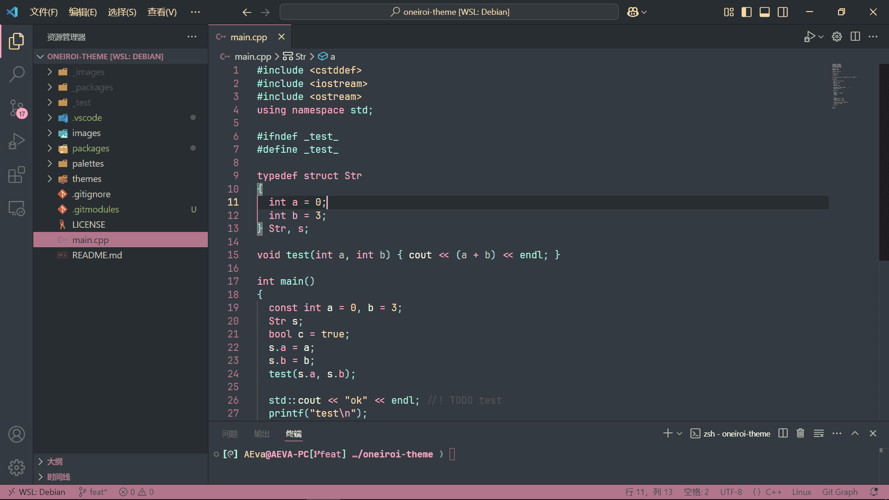
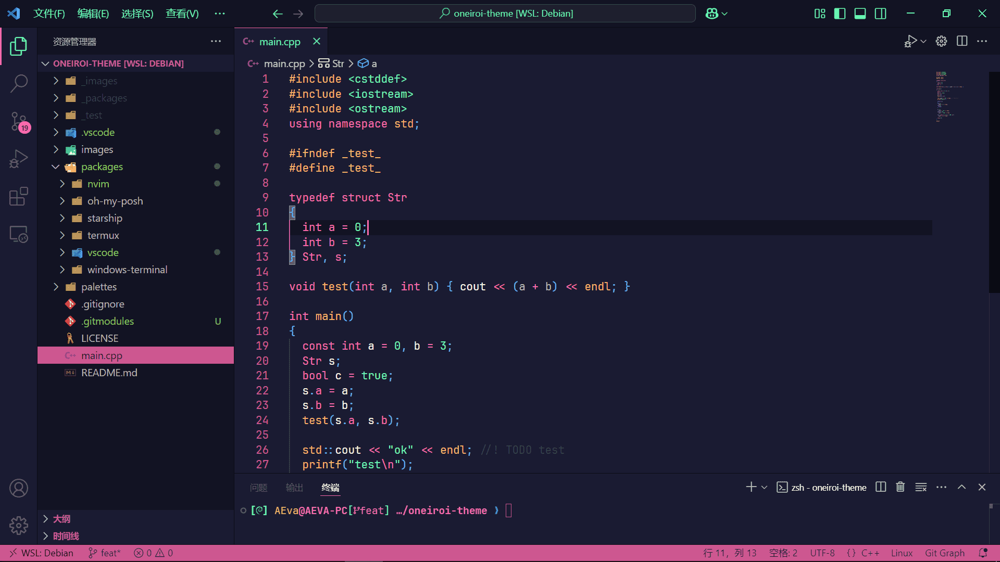

# Oneiroi theme for [Visual Studio Code](https://code.visualstudio.com/)

> A fantastic theme for `Visual Studio Code`.  

<p align="center">
  
</p>

<p align="center">
  <a href="https://github.com/OneiroiTheme/vscode/stargazers"></a>
  <a href="https://github.com/OneiroiTheme/vscode/issues"></a>
  <a href="https://github.com/OneiroiTheme/vscode/contributors"></a>
</p>

## Themes available

- oneiroi dream

<p align="center">
  
</p>

- oneiroi melatonin

<p align="center">
  
</p>

## Installation

Compile and install:

1. Clone this repository

    ```bash
    git clone "https://github.com/OneiroiTheme/vscode.git" ./vscode
    cd ./vscode
    ```

2. Install `vsce` if you haven't already

    ```bash
    npm install -g vsce
    ```

3. Package this extention

    ```bash
    vsce package
    ```

4. Install this extention
    1. Press `Ctrl+Shift+P` (or `Cmd+Shift+P` on macOS) to open the Command Palette.
    2. Type and select Extensions: `Install from VSIX....`
    3. Navigate to the location of `oneiroi-x.vsix` file
    4. Enjoy the oneiroi theme

Hello fantasy world!🎉
